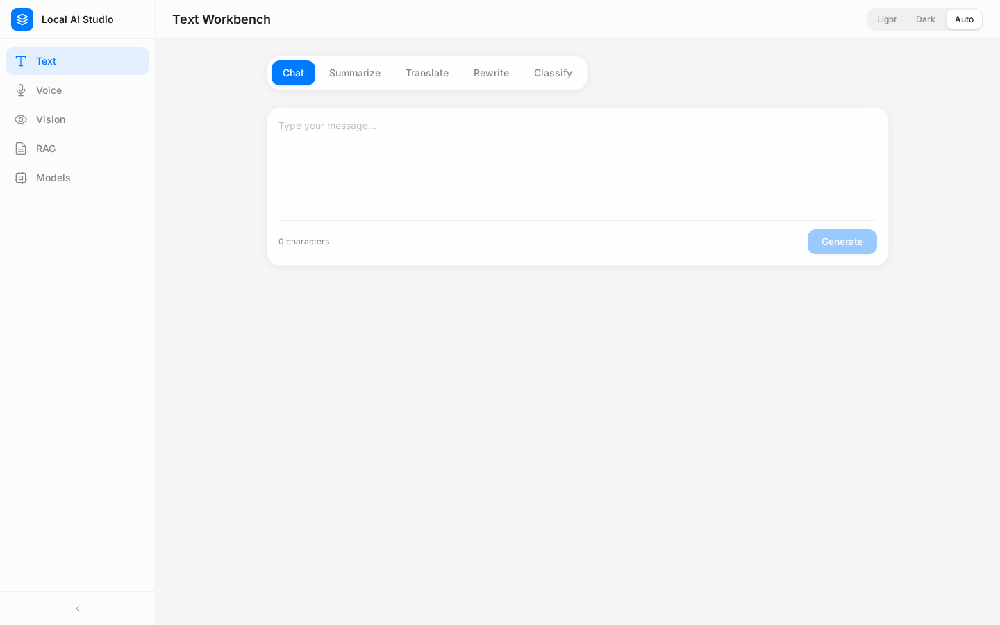
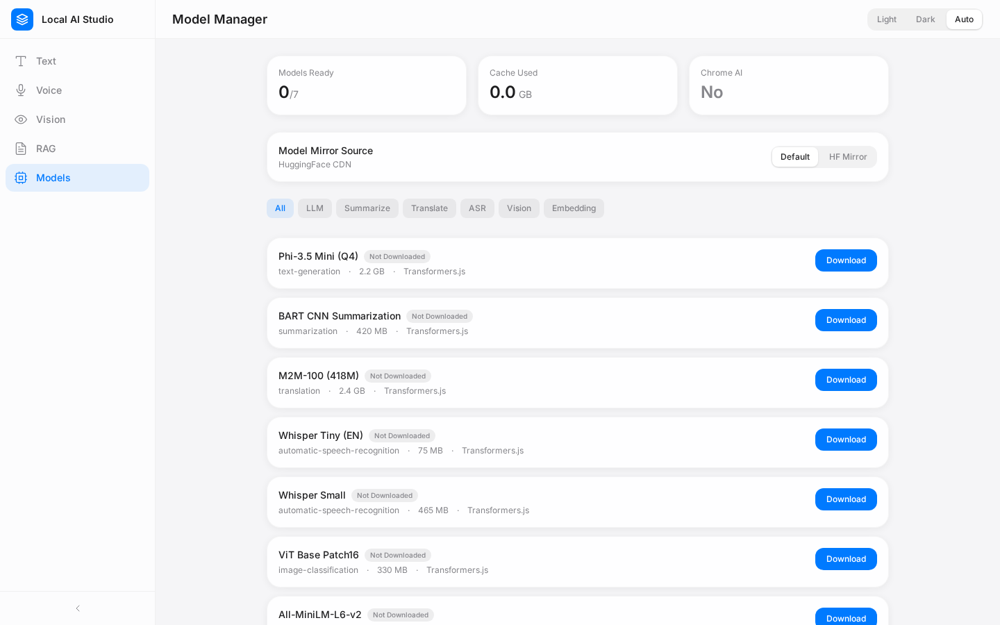
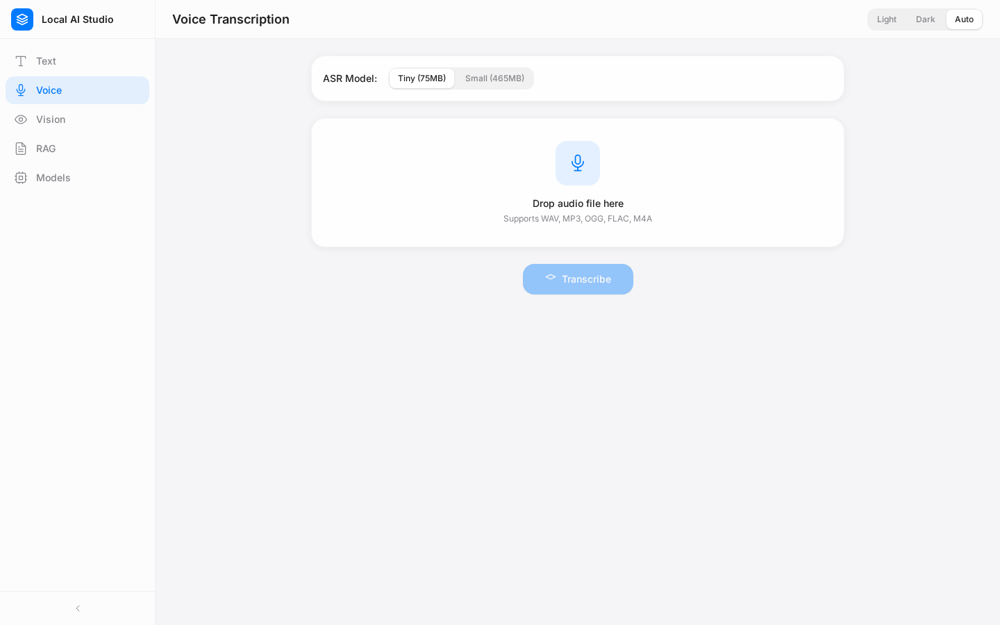

# Local AI Studio

**A privacy-first AI workbench that runs entirely in your browser. No servers, no uploads — your data never leaves your machine.**

Local AI Studio bundles five AI tools into one clean workspace, powered by two browser-native inference engines: **Chrome Built-in AI** (Gemini Nano) and **Transformers.js** (WebGPU/WASM). Everything — text processing, speech recognition, image understanding, document RAG — happens locally, on-device.



## ✨ Features

| Module | What it does |
|---|---|
| 💬 **Text Workbench** | Chat, summarize, translate, rewrite and classify — streaming output |
| 🎙️ **Voice Transcription** | Speech-to-text transcription, on-device |
| 👁️ **Visual Understanding** | Image understanding & captioning |
| 📚 **Local RAG** | Chat over your own documents — parsed and indexed locally (IndexedDB) |
| 🧠 **Model Manager** | Inspect loaded models, view download progress & inference stats |



## 🧠 How it works

Two inference backends, one unified API (`src/engine/inference-engine.ts`):

- **Chrome Built-in AI** — uses `window.ai` (Gemini Nano) when available for prompt, summarizer, translator, writer and rewriter APIs. Zero model download.
- **Transformers.js** — falls back to on-device WebGPU/WASM inference via Hugging Face models, streamed and cached in the browser.

The engine auto-detects capabilities and degrades gracefully: no Chrome AI? No problem — Transformers.js takes over. The app works in any modern browser; on Chrome with Gemini Nano you get the full experience.



## 🚀 Quick start

```bash
pnpm install
pnpm dev          # local dev server → http://localhost:5000
pnpm vite build   # production build → dist/
```

## 🏗️ Architecture

```
src/
├── engine/          # inference backends (chrome-ai, transformers, unified API)
├── pages/           # five module workspaces
├── components/      # layout & UI primitives
├── hooks/           # theme & state hooks
├── store/           # global app state (useReducer)
└── workers/         # background workers
```

## 🛠️ Tech stack

React 19 · TypeScript · Vite 7 · Tailwind CSS v4 · Express (dev server only) · Transformers.js · IndexedDB · pdfjs-dist

## ⚠️ Notes

- **Chrome AI features** require Chrome with Gemini Nano enabled (`chrome://flags/#optimization-guide-on-device-model`).
- **Model downloads** are streamed from Hugging Face on first use and cached locally afterwards.
- Static-host friendly: the built app has zero backend dependencies — it runs on any static host (GitHub Pages included).

## 📄 License

MIT
